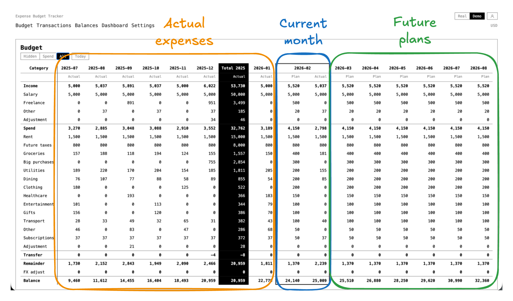

# expense-budget-tracker

Self-hosted open-source expense and budget tracker with balances, transfers, and multi-currency reporting on Postgres.



## Quick start

```bash
make up    # start Postgres, run migrations, start web + worker
```

Open `http://localhost:3000`.

### Demo mode

To preview all dashboards without a database, set `DEMO_MODE=true` or click "Try Demo" in the topbar. Demo mode serves static sample data and discards writes.

## Documentation

- [Architecture](docs/architecture.md) — system overview, data model, multi-currency design
- [Deployment](docs/deployment.md) — local Docker Compose and AWS CDK setup
- [AWS deployment](infra/aws/README.md) — full AWS CDK guide
